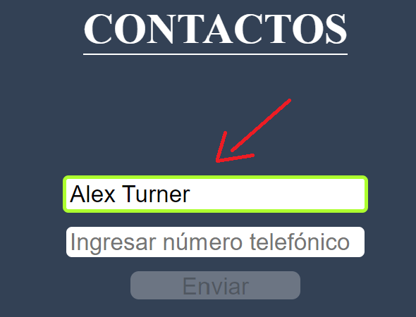
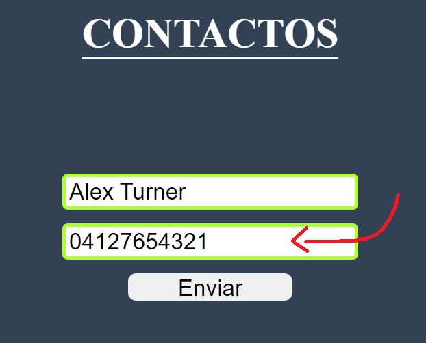
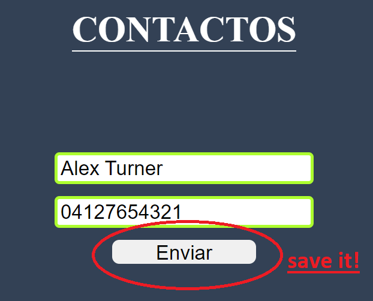
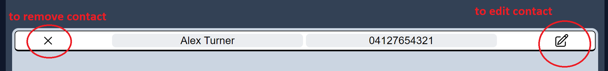
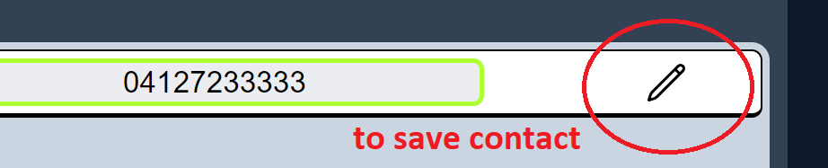
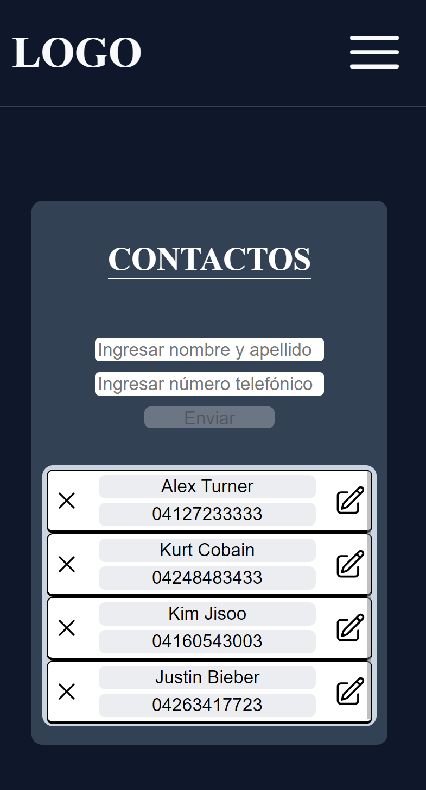

# Contact List App

Hi there!

Do you have a lot of contacts and have no idea how and where to save them? I got the solution for you! In this app you will be able to save your friend's number easily. This is how works:

__Step one:__ 

In the first input you must add the name and last name of the person you want to save. But be careful, both the first name and the last name must have between 2 and 16 letters and only one space between. Do not use symbols or numbers in this step!

__Step two:__

Add your friend's numbers. In this step, the number must be venezuelan, meaning it has to start with the prefix of 0212, 0412, 0414, 0424, 0416, 0426. (e.g., 0412xxxxxxx). The second thing to consider is that prefix must be following by 7 random numbers. (e.g., 04121234567). Do not use spaces, letters or symbols in this step!

__Step three:__

Now you are ready to save your new contact just clicking the "Enviar" button!. If this button is not enabled, please check out the previous steps!

Alright, now that you have saved your contact sucesfully, you can see it in the contact list box just below. But that's not all buddy, there's more! You can delete your contact if you want just clicking the "X" button at the very left, and edit your contact information just clicking the pencil icon at the very right

To edit your contact is actually very easy, after clicking the pencil icon, you will be able to edit the contact information. Consider that it has the exactly verification as at the beggining part (1st step and 2nd step). And do not left the box information empty, if you do, you won't be able to save the contact again, so you must have to type a correct name and correct venezuelan number.

And that's it folks. You can save unlimited contacts and do not worry about losing the contacts after you close the App, because it saves the information in your web browser automatically (local storage). 

Also you can use in your pc, laptop or smartphone.

Enjoy!

